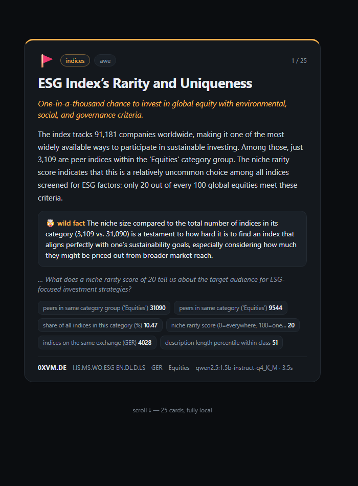
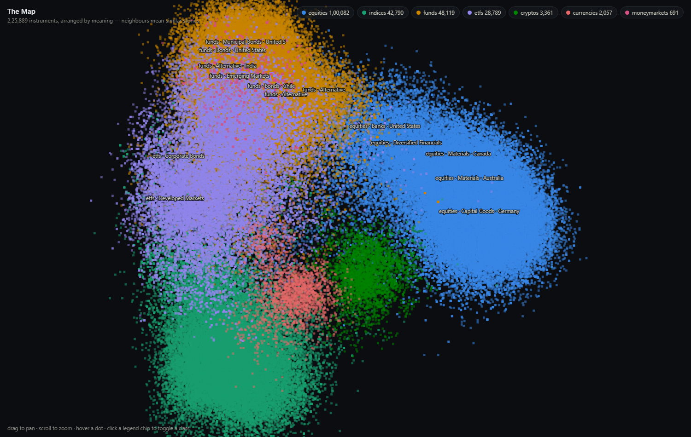

# ScrollStreet

**The financial universe as an infinite scroll — fully local.**

TikTok taught machines to learn what you can't look away from. ScrollStreet points
that machinery at something worth being addicted to: the weird, vast landscape of
353,000+ financial instruments — and runs the whole thing on your own computer.
No APIs. No accounts. No cloud. Your attention data never leaves your disk.

| The feed | The map |
|---|---|
|  |  |

## What it does

- **A story-card feed** — swipe through 25 cards per session. Each card is one
  instrument (a stock, a dead penny company, an obscure Chilean bond fund, a
  cryptocurrency) turned into a mini-story by a local LLM: headline, hook,
  a wild fact, and an open question that makes you want the next card.
- **Real math, no hallucinated numbers** — every statistic on a card is computed
  from the database itself (peer counts, niche rarity, industry survival rates,
  cross-listing counts). The LLM is contractually forbidden from using any number
  not handed to it. The model writes the *story*; the math stays *true*.
- **The Map** — all 225,889 instruments embedded into a semantic manifold and
  drawn on one canvas. Tesla's nearest neighbours come back as Ford, GM, Tata
  Motors and Volkswagen — because the layout is built from *meaning*, not
  categories. Pan, zoom, hover; the lonely corners are where the treasure is.
- **An attention log** — every dwell, swipe, and session lands in a local JSONL
  file. That's the training data for what comes next: a feed that learns *you*.

## How it works

```
FinanceDatabase (353k symbols, categorized)          <- JerBouma/FinanceDatabase
        │  scripts/build_dataset.py  (one-time: bz2 -> parquet, ~20x faster loads)
        ▼
data/catalog.parquet   4.75 MB unified candidate pool, loads in 0.08s
        │
        │  scripts/build_map.py  (one-time: local embeddings -> semantic manifold)
        ▼
data/embeddings.parquet + map_meta.parquet   the Map: neighbours, density, 400 hoods
        │
        ▼                          per scroll:
src/ordering.py  ── picks a symbol (random walk today; map-navigation next)
src/enrich.py    ── computes census statistics for it (the only numbers allowed)
src/cards.py     ── local LLM (Ollama) writes the story card as JSON
web/index.html   ── scroll-snap feed, 25-card cap, 3-card lookahead buffer
server.py        ── stdlib HTTP server on 127.0.0.1, zero dependencies
```

Everything heavy is paid once at build time; at scroll time the only expensive
thing in the loop is the LLM — by design.

## Quickstart

Requirements: Python 3.10+, [Ollama](https://ollama.com), git. Works on a normal
laptop; a GPU helps but isn't required.

```powershell
git clone https://github.com/GURKAMAL2004/scrollstreet
cd scrollstreet
python -m venv .venv
.venv\Scripts\pip install -r requirements.txt          # Linux/mac: .venv/bin/pip

# 1. get the content universe (FinanceDatabase, ~170 MB)
git clone --depth 1 https://github.com/JerBouma/FinanceDatabase data/raw/FinanceDatabase

# 2. build the fast local data layer (~30s)
.venv\Scripts\python scripts\build_dataset.py

# 3. pull the local models
ollama pull qwen2.5:1.5b-instruct-q4_K_M     # card writer (small + fast)
ollama pull nomic-embed-text                 # embeddings for the map

# 4. (optional, ~1h once) build the semantic map
.venv\Scripts\python scripts\build_map.py

# 5. scroll
.venv\Scripts\python server.py
# feed -> http://127.0.0.1:8765     map -> http://127.0.0.1:8765/map
```

Want better prose? Any Ollama chat model works:
`$env:FEED_MODEL = "qwen2.5:14b-instruct-q4_K_M"` before starting the server.

## Philosophy

Most "AI × finance" projects chase alpha — predicting returns, beating the market.
That's the most competitive game on Earth, and a laptop with free data loses it.
ScrollStreet plays a game you can actually win at home: **predicting your own
curiosity**. The ground truth (your dwell time) arrives free, abundantly, every
session — and the same ideas the big feeds use (latent-space navigation,
exploration vs. exploitation, uncertainty as fuel) work honestly here.

The roadmap, every design decision, and the full development journal — including
the wrong turns — live in [`readme_claude/`](readme_claude/README.md). Next up:
map-powered ordering (linger on a card → the next one comes from its
neighbourhood; swipe fast → whiplash to the far side of the map), then a
Thompson-sampling taste model over the attention log.

## Credits

- [FinanceDatabase](https://github.com/JerBouma/FinanceDatabase) by Jeroen Bouma —
  the magnificent, free, community-maintained content universe this runs on.
- [Ollama](https://ollama.com) + `nomic-embed-text` + Qwen 2.5 — the local brains.

MIT licensed. Built with [Claude Code](https://claude.com/claude-code).
